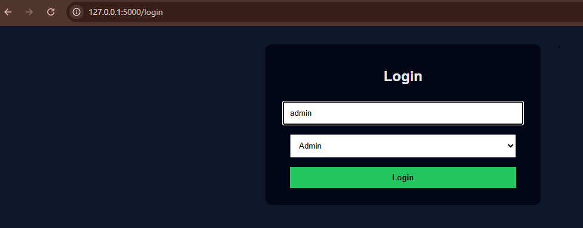
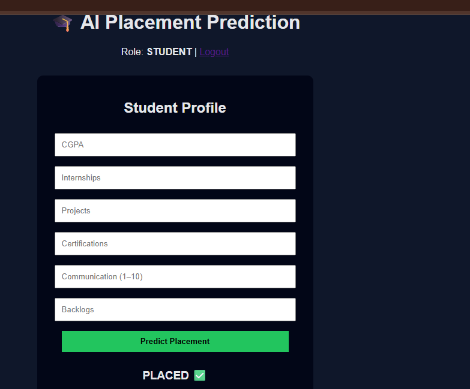
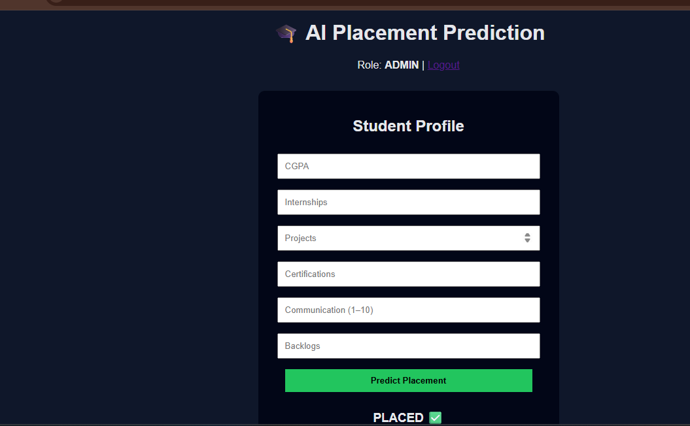

# 🎓 AI Placement Prediction System

An AI-powered web application that predicts student placement outcomes using Machine Learning and Flask.


---

## 🚀 Project Overview

The **AI Placement Prediction System** helps students and institutions estimate placement probability based on academic and skill-related parameters such as CGPA, internships, projects, certifications, communication skills, and backlogs.

The system uses a **Random Forest Classifier** for prediction and provides **role-based access**:
- **Students** → Placement prediction
- **Admins** → Model insights and analytics

---

## 🧠 Key Features

- 🔐 Role-based Login (Student / Admin)
- 🤖 Machine Learning–based Placement Prediction
- 📊 Admin Analytics Dashboard (Feature Importance & Distribution Charts)
- 📈 Probability-based Prediction Output
- 🧩 Clean MVC Architecture using Flask
- 📦 Standalone `.exe` build using PyInstaller

---

## 🛠️ Tech Stack

| Category | Technologies |
|--------|-------------|
| Programming | Python |
| Web Framework | Flask |
| Machine Learning | Scikit-learn (Random Forest) |
| Frontend | HTML, CSS |
| Visualization | Plotly |
| Packaging | PyInstaller |

---

## 📂 Project Structure

AI Placement Prediction System/
│
├── app.py
├── train_model.py
├── placement_model.pkl
│
├── templates/
│ ├── login.html
│ └── dashboard.html
│
├── static/
│ └── style.css
│
└── README.md


---

## ▶️ How to Run the Project

### Step 1: Train the Model
```bash
python train_model.py


Step 2: Run the Application
python app.py


Open in browser:

http://127.0.0.1:5000/login

📦 Build Executable (.exe)
pyinstaller --onefile --add-data "templates;templates" --add-data "static;static" app.py


Executable will be generated inside:

dist/app.exe

🎓 Academic Use Case
Placement Prediction System
Machine Learning + Web Application Integration

👩‍💻 Author

Aathila Fathima
B.Tech – Computer Science (Cyber Security)
📌 Aspiring Software / ML Engineer

---

---

## 📷 Screenshots

### 🔐 Login Page


### 🎓 Student Dashboard – Placement Prediction


### 📊 Admin Dashboard – Model Insights


### ✅ Prediction Result

